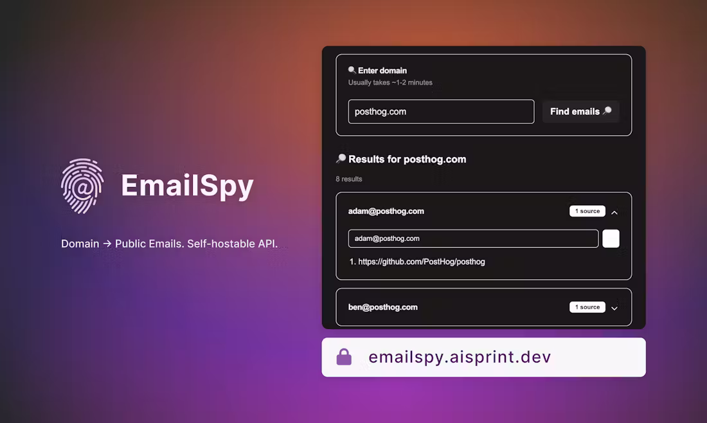

## EmailSpy - Find public emails across domains, even the sneaky ones

EmailSpy scrapes multiple sources to uncover publicly available emails for any domain. It even catches those tricky [at] symbols. Uses hybrid Firecrawl and Puppeteer approach. Try it, then clone and customize this low-code, open-source tool for free.

> **🚨 Important:** This is a fronend of the app. The real magic happens in n8n workflow. You can find more information about it [here](https://30dayaisprint.notion.site/Duplicate-EmailSpy-10a5b6e0c94f8003bce4f03dd023d975).

> **⚠️ Note:** EmailSpy is my very first project in Next.js (I'm not a professional frontend developer) and it's been made 90% with AI. I'm sure there are many things that could be improved. For any suggestions, I'll be very grateful.



## How to use

### 0. Set up n8n workflow

You can find instructions [here](https://30dayaisprint.notion.site/Duplicate-EmailSpy-10a5b6e0c94f8003bce4f03dd023d975).

### 1. Clone the repository

```bash
git clone https://github.com/workfloows/emailspy-ui.git
```

### 2. Install dependencies

```bash
npm install
```

### 3. Set up environment variables

Replace `N8N_INSTANCE_URL` in `.env` with your n8n instance URL.

```
N8N_INSTANCE_URL=https://your-n8n-instance.com
```

If developing locally, set `N8N_INSTANCE_URL` to local address of n8n (e.g. `http://0.0.0.0:5678`).

### 3. Change callback URLs

If developing locally, change callback URLs in `app/actions.ts` to match your local address.

```
const callbackUrl = `http://localhost:3000/api/email-results/${callbackId}`
```

```
const response = await fetch(`http://localhost:3000/api/email-results/${callbackId}`)
```

If deploying to Vercel, leave both callback URLs unchanged.

### 4. Run the development server

```bash
npm run dev
```

## Deploy to Vercel

a) Deploy preview

```bash
vercel
```

b) Deploy production

```bash
vercel --prod
```
